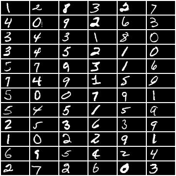
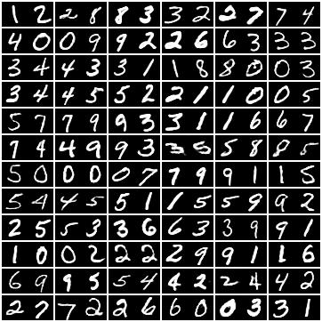

# DisUnknown: Distilling Unknown Factors for Disentanglement Learning

## Requirements

- PyTorch >= 1.8.0
    - [`torch.linalg.eigh()`](https://pytorch.org/docs/stable/generated/torch.linalg.eigh.html#torch.linalg.eigh) is used in a few places. If you use a older version please change them to [`torch.symeig()`](https://pytorch.org/docs/stable/generated/torch.symeig.html#torch.symeig)
- [PyYAML](https://pyyaml.org/), for loading configuration files
- Optional: [h5py](https://www.h5py.org/), for using the 3D Shapes dataset
- Optional: [Matplotlib](https://matplotlib.org/stable/index.html), for plotting sample distributions in code space

## Preparing Datasets

Dataset classes and default configurations are provided for the following datasets. See below for how to add new datasets, or you can open an issue and the author might consider adding it. Some datasets need to be prepared before using:

```
$ python disentangler.py prepare_data <dataset_name> --data_path </path/to/dataset>
```

If the dataset does not have a standard training/test split it will be split randomly. Use the `--test_portion <portion>` option to set the portion of test samples. Some dataset have additional options.

- MNIST, Fashion-MNIST, QMNIST, SVHN
    - Dataset names are `mnist`, `fashion_mnist`, `qmnist`, `svhn`.
    - `data_path` should be the same as those for the built-in dataset classes provided by torchvision.
    - We use the full NIST digit dataset from QMNIST (`what = 'nist'`) and it needs to be split.
    - For SVHN, set `include_extra: true` in `dataset_args` in the configuration file (this is the default) to include the extra training images in the training set.
- CIFAR-10
    - Dataset name is `cifar10`
    - `data_path` should be the same as those for the built-in dataset classes provided by torchvision.
    - It doesn't really make much sense to run our method on a general classification dataset but the built-in dataset comes for free so why not give it a shot and see what happens :)
- [3D Chairs](https://www.di.ens.fr/willow/research/seeing3Dchairs/)
    - Dataset name is `chairs`.
    - `data_path` should be the folder containing the `rendered_chairs` folder.
    - Needs to be split.
    - You may use `--compress` to down-sample all images and save them as a NumPy array of PNG-encoded `bytes`. Use `--downsample_size <size>` to set image size, default to 128. Note that this does not dictate the training-time image size, which is configured separately. Compressing the images speeds up training only slightly if a multi-processing dataloader is used but makes plotting significantly faster.
    - Unrelated to this work, but the author wants to note that this dataset curiously contains 31 azimuth angles times two altitudes for a total of 62 images for each chair with image id `031` skipped, apparently because 32 was the intended number of azimuth angles but when they rendered the images those angles were generated using `numpy.linspace(0, 360, 32)`, ignoring the fact that 0 and 360 are the same angle, then removed the duplicated images `031` and `063` after they realized the mistake. Beware of off-by-one errors in linspace, especially if it is also circular!
- [3D shapes](https://github.com/deepmind/3d-shapes)
    - Dataset name is `3dshapes`.
    - `data_path` should be the folder containing `3dshapes.h5`.
    - Needs to be split.
    - You may use `--compress` to extract all images and then save them as a NumPy array of PNG-encoded `bytes`. This is mainly for space-saving: the original dataset, when extracted from HDFS, takes 5.9GB of memory. The re-compressed version takes 2.2GB. Extraction and compression takes about an hour.
- [dSprites](https://github.com/deepmind/dsprites-dataset)
    - Dataset name is `dsprites`
    - `data_path` should be the folder containing the `.npz` file.
    - Needs to be split.
    - This dataset is problematic. I found that orientation 0 and orientation 39 are the same, and presumably that was because similar to 3D Chairs something like `linspace(0, 360, 40)` was used to generate the angles. So yes, I'm telling you again, beware of off-by-one errors in linspace, especially if it is also circular! Anyway in my dataset class I discarded orientation 39, so there are only 39 different orientations and 3 * 6 * 39 * 32 * 32 = 718848 images.
    - The bigger problem is that each of the three shapes (square, ellipse, heart) has a different symmetry. For hearts, each image uniquely determines an orientation angle; for ellipses, each image has two possible orientation angles; and for squares, each image has four possible orientation angles. They managed to make the dataset so that (apart from orientation 0 and 39 being the same) different orientations correspond to different images because 2 and 4 are not divisors of 39 (which makes me wonder if the off-by-one error was intentional) but the orientation is still conceptually wrong, since if you consider the orientation angles of ellipses modulo 180 or the orientation angles of squares modulo 90, then the orientation class IDs are not ordered in increasing order of orientation angles. Instead the orientation angles of ellipses go around twice in this range and the orientation angles of squares go around four times. To solve this problem, I included an option to set `relabel_orientation: true` in `dataset_args` in the configuration file (this is the default) which will cause the orientation of ellipses and squares to be re-labeled in the correct order. Specifically, for ellipses orientation *t* is re-labeled as (*t* * 2) % 39 and for squares orientation *t* is re-labeled as (*t* * 4) % 39. But still, this causes ellipses to rotate twice as slowly and squares to rotate four times as slowly when the orientation increases, which is still not ideal. When shapes with different symmetries are mixed there is simply no easy solution, and do not expect good results on this dataset if the unknown factor contains the orientation.
    - `--compress ` does the same thing as in 3D Shapes.

## Training

To train, use

```
$ python disentangler.py train --config_file </path/to/config/file> --save_path </path/to/save/folder>
```

The configuration file is in YAML. See the [commented example](config_example.yaml) for explanations. If `config_file` is omitted, it is expected that `save_path` already exists and contains `config.yaml`. Otherwise `save_path` will be created if it does not exist, and `config_file` will be copied into it. If `save_path` already contains a previous training run that has been halted, it will by default resume from the latest checkpoint. `--start_from <stage_name> [<iteration>]` can be used to choose another restarting point. `--start_from stage1` to restart from scratch. Specifying `--data_path` or `--device` will override those settings in the configuration file.

Although our goal is to deal with the cases where some factors are labeled and some factors are unknown, it feels wrong not to extrapolate to the cases where all factors are labeled or where all factors are unknown. Wo do allow these, but some parts of our method will become unnecessary and will be discarded accordingly. In particular if all factors are unknown then we just train a VAE in stage I and then a GAN having the same code space in stage II, so you can use this code for just training a GAN. We don't have the myriad of GAN tricks though.

## Meaning of Visualization Images

During training, images generated for visualization will be saved in the subfolder `samples`. `test_images.jpg` contains images from the test set in even-numbered columns (starting from zero), with odd-numbered columns being empty. The generated images will contain corresponding reconstructed images in even-numbered columns, while each image in odd-numbered columns is generated by combining the unknown code from its left and the labeled code from its right (warp to the next row).

Example test images:



Example generated images:



## Adding a New Dataset

`__init__()` should accept four positional arguments `root`, `part`, `labeled_factors`, `transform` in that order, plus any additional keyword arguments that one expects to receive from `dataset_args` in the configuration file. `root` is the path to the dataset folder. `transform` is as usual. `part` can be `train`, `test` or `plot`, specifying which subset of the dataset to load. The plotting set is generally the same as the test set, but `part = 'plot'` is passed in so that a smaller plotting set can be used if the test set is too large.

`labeled_factors` is a list of factor names. `__getitem__()` should return a tuple `(image, labels)` where `image` is the image and `labels` is a one-dimensional PyTorch tensor of type `torch.int64`, containing the labels for that image in the order listed in `labeled_factors`. `labels` should always be a one-dimensional tensor even if there is only one labeled factor, not a Python `int` or a zero-dimensional tensor. If `labeled_factors` is empty then `__getitem__()` should return `image` only.

In addition, metadata about the factors should be available in the following properties: `nclass` should be a list of `int`s containing the number of classes of each factor, and `class_freq` should be a list of PyTorch tensors, each being one-dimensional, containing the distribution of classes of each factor in (the current split of) the dataset.

If any preparation is required, implement a static method `prepare_data(args)` where `args` is a return value of `argparse.ArgumentParser.parse_args()`, containing properties `data_path` and `test_portion` by default. If additional command-line arguments are needed, implement a static method `add_prepare_args(parser)` where `parser.add_argument()` can be called.

Finally add it to the dictionary of recognized datasets in `data/__init__.py`.

Default configuration should also be created as `default_config/datasets/<dataset_name>.yaml`. It should at a minimum contain `image_size`, `image_channels` and `factors`. `factors` has the same syntax as `labeled_factors` as explained in the example training configuration. It should contain a complete list of all factors. In particular, if the dataset does not include a complete set of labels, there should be a factor called `unknown` which will become the default unknown factor if `labeled_factors` is not set in the training configuration.

Any additional settings in the default configuration will override global defaults in `default_config/default_config.yaml`.
